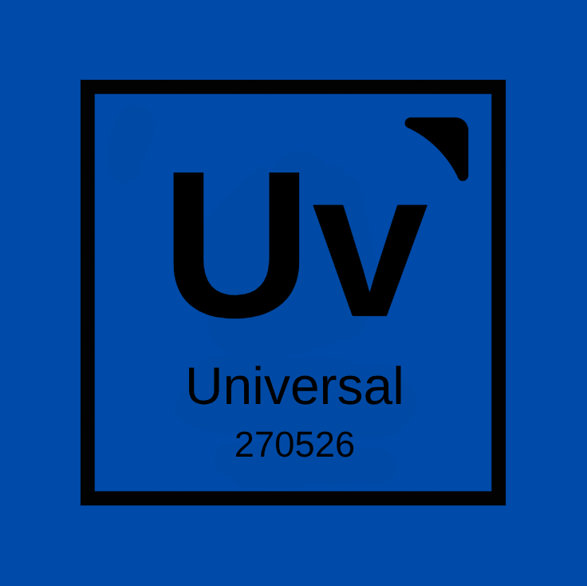
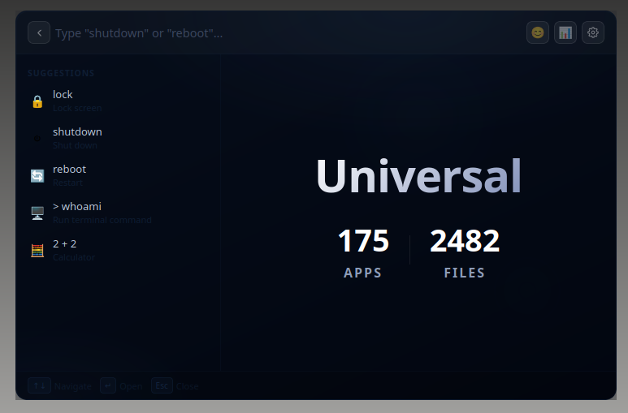
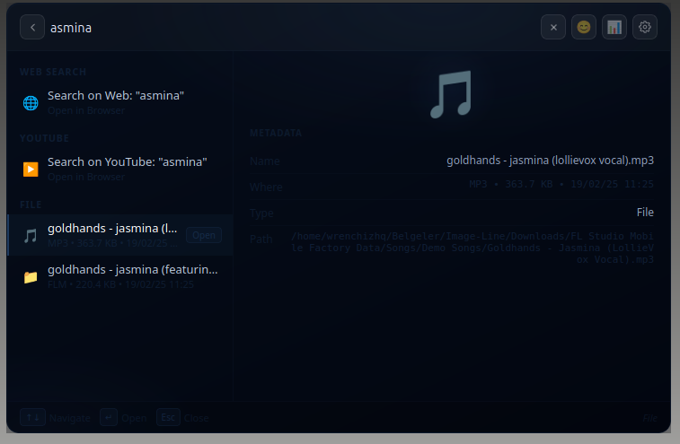
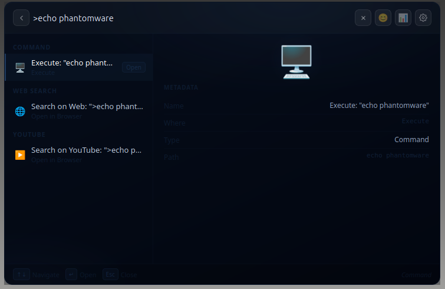
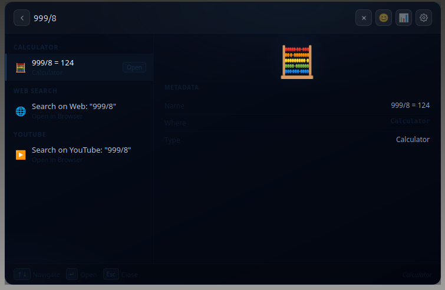
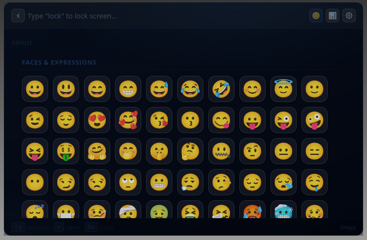
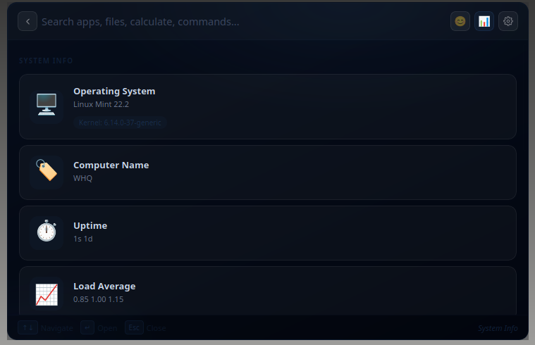
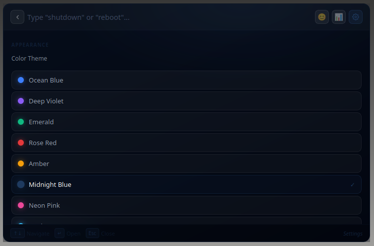
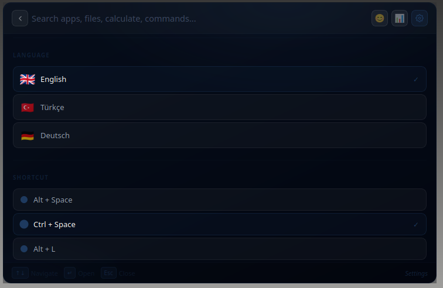

# Universal (Beta v1.3)  
Made With ❤️ by **Phantomware**  
> **Developer:** Wrenchiz  
> **Version:** Beta v1.3  
> **Download for Windows (Portable):** [Universal Launcher Beta v1.3 for Windows (Portable)](https://github.com/Phantomware-HQ/Universal/releases/download/v1.3/Universal_Launcher_Beta_v1_3_Windows_Portable.zip)  
> **Download for Linux (Portable):** [Universal Launcher Beta v1.3 for Linux (Portable)](https://github.com/Phantomware-HQ/Universal/releases/download/v1.3/Universal_Launcher_Beta_v1_3_Linux_Portable.zip)  

---

## 📸 Screenshots

  

  

  

  

  

  

  

---

# Phantomware Official Website

> **Official Website:** [https://phantomware.netlify.app/](https://phantomware.netlify.app/)

---

## ⚖️ License

This project is licensed under the **CC BY-NC-ND 4.0** License. 
See the [LICENSE](https://github.com/codeX-Studio-HQ/Universal?tab=License-1-ov-file) file for the full legal text.

© 2026 Phantomware
